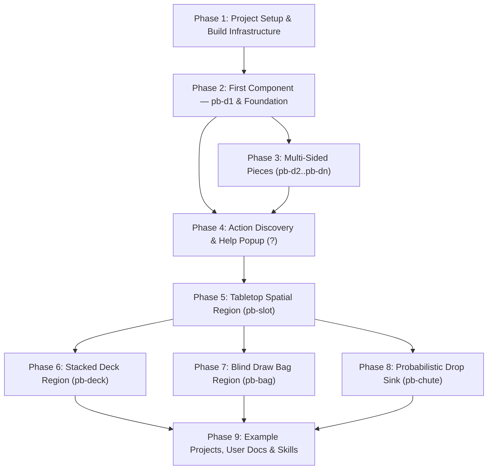

# Protoboard Implementation Roadmap & Specifications

Based on the architectural specifications defined in [`docs/agricola.md`](./agricola.md), this document details the phased, component-by-component implementation roadmap for **Protoboard**. Each phase is ordered strictly by its architectural and runtime dependencies, and all tasks are numbered hierarchically for reference.

---

## 1. Dependency Graph

---

## 2. Phased Implementation Plan

### Phase 1: Project Setup & Build Infrastructure

**Goal**: Establish the repository foundation, build tooling, TypeScript environment, and unit/visual test runners.
**Dependencies**: None.

- [ ] **1. Phase 1: Project Setup & Build Infrastructure**
  - [x] **1.1 Package & Dependencies Setup**
    - [x] 1.1.1 Initialize `package.json` with runtime dependencies (`lit`, `grapevine`).
    - [x] 1.1.2 Configure dev dependencies (`typescript`, `rollup`, `@rollup/plugin-node-resolve`, `@rollup/plugin-typescript`, `@rollup/plugin-terser`, `@playwright/test`, `eslint`, `prettier`).
  - [x] **1.2 TypeScript & Linter Configuration**
    - [x] 1.2.1 Configure `tsconfig.json` (`target: ES2022`, `module: ESNext`/`NodeNext`, `strict: true`).
    - [x] 1.2.2 Configure ESLint and Prettier configurations.
  - [x] **1.3 Bundler Pipeline**
    - [x] 1.3.1 Configure `rollup.config.mjs` to output standalone bundle `dist/protoboard.min.js` (IIFE format with Lit & Grapevine embedded for drop-in `<script>` consumption) and ESM module `dist/index.mjs`.
    - [x] 1.3.2 Configure TypeScript declaration generation in `dist/types/`.
  - [ ] **1.4 Test Runner Infrastructure**
    - [ ] 1.4.1 Configure `playwright.config.ts` for unified component unit tests, interaction flows, and visual golden screenshot tests across Chromium, Firefox, and WebKit.

---

### Phase 2: First Component — `pb-d1` & Foundation Infrastructure

**Goal**: Build the first complete piece component (`pb-d1`) along with all core foundation systems required for it: Grapevine DI registration sources, `HeldStackManager`, cursor floating overlay, input routing, packaging, interactive demo, and visual golden tests.
**Dependencies**: Phase 1.

- [ ] **2. Phase 2: First Component — `pb-d1` & Foundation Infrastructure**
  - [ ] **2.1 Grapevine DI & Registration Foundation (`src/core/`)**
    - [ ] 2.1.1 Model registration configuration and custom element registry as Grapevine `source`s (`$registerOptions`, `$customElementsRegistry`), allowing test fixtures to override options like `ignoreExisting: true`.
    - [ ] 2.1.2 Implement dynamic registration function `registerProtoboard(options?: RegisterOptions)` registering `pb-d1`.
  - [ ] **2.2 Held Stack & Cursor Floating Overlay (`src/core/held-stack-manager.ts`)**
    - [ ] 2.2.1 Implement `HeldStackManager` LIFO stack operations (`push`, `pop`, `popAll`, `peek`, `isEmpty`, `clear`).
    - [ ] 2.2.2 Implement floating overlay manager (`position: fixed; pointer-events: none; transform: translate(...)`) that tracks mouse movements and reparents picked pieces.
    - [ ] 2.2.3 Declare Grapevine source `$heldStack: Source<HeldStackManager> = source(() => new HeldStackManager())`.
  - [ ] **2.3 Input & Action Dispatcher (`src/core/input-dispatcher.ts`, `src/core/base-element.ts`)**
    - [ ] 2.3.1 Implement `BaseProtoboardElement` extending `LitElement` with `Vine` context access, lifecycle management, and custom `name` attribute support (`getAttribute('name') || tagName.toLowerCase()`).
    - [ ] 2.3.2 Implement hover (`mouseenter`/`mouseleave`) and focus (`focus`/`blur`) target tracking.
    - [ ] 2.3.3 Implement declarative action attribute parsing (`action-[actionName]-shortcut`, `action-[actionName]-enable`).
    - [ ] 2.3.4 Implement keypress listener and direct piece action dispatching (`c` -> `piece.pick()`).
  - [ ] **2.4 `D1Piece` Component (`<pb-d1>`, `src/pieces/d1-piece.ts`)**
    - [ ] 2.4.1 Single face (`slot="face0"`).
    - [ ] 2.4.2 Shadow DOM render logic projecting `<slot name="face0"></slot>`.
    - [ ] 2.4.3 `pick()` action integration with `HeldStackManager`.
  - [ ] **2.5 Packaging, Demo Harness & Testing**
    - [ ] 2.5.1 Set up and verify build scripts (`dist/protoboard.min.js`, `dist/index.mjs`).
    - [ ] 2.5.2 Create `examples/index.html` demo showing `pb-d1` pieces with hover, pick, and floating cursor overlay.
    - [ ] 2.5.3 Playwright unit & component tests for `pb-d1`, `HeldStackManager`, and input dispatcher.
    - [ ] 2.5.4 Playwright visual golden screenshot tests for `pb-d1` face projection and floating cursor overlay.

---

### Phase 3: Multi-Sided Pieces (`pb-d2`, `pb-d4`, `pb-d6`, `pb-d8`, `pb-d12`, `pb-d20`, `pb-dn`)

**Goal**: Implement the remaining piece components, face switching, dice rolling, opposite face arithmetic on flippable pieces, and visual golden tests.
**Dependencies**: Phase 2.

- [ ] **3. Phase 3: Multi-Sided Pieces (`pb-d2` through `pb-dn`)**
  - [ ] **3.1 Base Piece Abstraction (`src/pieces/base-piece.ts`)**
    - [ ] 3.1.1 Reactive `activeFace` property (0-indexed).
    - [ ] 3.1.2 Shadow DOM projection rendering `<slot name="face${this.activeFace}"></slot>`.
    - [ ] 3.1.3 Base piece actions: `roll()` (shortcut `r`), `nextFace()` (shortcut `]`), `prevFace()` (shortcut `[`).
  - [ ] **3.2 Flippable Pieces & Polyhedral Components (`src/pieces/`)**
    - [ ] 3.2.1 `D2Piece` (`<pb-d2>`): 2 faces (coins, double-sided cards), implements `flip()` (shortcut `f`: `face0 <-> face1`).
    - [ ] 3.2.2 `D4Piece` (`<pb-d4>`): 4 faces (tetrahedral die), implements `flip()` (shortcut `f`: `face0 <-> face3`, `face1 <-> face2`).
    - [ ] 3.2.3 `D6Piece` (`<pb-d6>`): 6 faces (cubic die), implements `flip()` with opposite sum 7 (`(N - 1) - current`).
    - [ ] 3.2.4 `D8Piece` (`<pb-d8>`): 8 faces (octahedral die), implements `flip()` with opposite sum 9.
    - [ ] 3.2.5 `D12Piece` (`<pb-d12>`): 12 faces (dodecahedral die), implements `flip()` with opposite sum 13.
    - [ ] 3.2.6 `D20Piece` (`<pb-d20>`): 20 faces (icosahedral die), implements `flip()` with opposite sum 21.
    - [ ] 3.2.7 `DNPiece` (`<pb-dn>`): N faces via `sides="N"` attribute.
  - [ ] **3.3 Registration & Showcase Update**
    - [ ] 3.3.1 Incrementally register all piece tags in `registerProtoboard`.
    - [ ] 3.3.2 Update `examples/index.html` with dice gallery (coins, d4, d6, d8, d12, d20, dn).
  - [ ] **3.4 Unit & Visual Golden Testing**
    - [ ] 3.4.1 Playwright unit & component tests for face cycling, opposite math verification, and roll distributions.
    - [ ] 3.4.2 Playwright visual golden screenshot tests for multi-sided dice faces and flipping state transitions.

---

### Phase 4: Action Discovery & Help Popup System (`?` Action)

**Goal**: Implement the interactive action discovery popup triggered by `?` using a bubbling DOM event (`QueryActionsEvent`), custom name resolution, and the dedicated `<pb-action-popup>` custom element.
**Dependencies**: Phase 2, Phase 3.

- [ ] **4. Phase 4: Action Discovery & Help Popup System (`?`)**
  - [ ] **4.1 `QueryActionsEvent` & Action Descriptors (`src/core/action-descriptor.ts`)**
    - [ ] 4.1.1 Define action metadata interfaces (`ActionDescriptor`: id, label, shortcut, enabled, isShadowed, handler).
    - [ ] 4.1.2 Implement `QueryActionsEvent` custom bubbling event (`pb-query-actions`, `bubbles: true`, `composed: true`).
    - [ ] 4.1.3 Implement `getActionDescriptors()` on `BaseProtoboardElement` returning local actions and shortcut bindings.
  - [ ] **4.2 Ancestor Event Interception & Action Aggregation**
    - [ ] 4.2.1 Intercept `pb-query-actions` as it bubbles through intermediate Protoboard components and append action groups with custom component `name` (or tag name).
    - [ ] 4.2.2 Implement shortcut shadowing resolution (marking container actions as shadowed when child components claim the same key).
  - [ ] **4.3 `<pb-action-popup>` Custom Element (`src/core/action-popup.ts`)**
    - [ ] 4.3.1 Implement `<pb-action-popup>` element listening at document root for `pb-query-actions`.
    - [ ] 4.3.2 Render floating popup anchored to `event.detail.targetElement` with categorized action lists.
    - [ ] 4.3.3 Implement click-to-execute action handlers.
    - [ ] 4.3.4 Implement dismissal handlers (`Escape`, pressing `?` again, clicking outside, or executing an action).
    - [ ] 4.3.5 Register `pb-action-popup` in `registerProtoboard`.
  - [ ] **4.4 Testing & Visual Goldens**
    - [ ] 4.4.1 Playwright unit & component tests for `QueryActionsEvent` bubbling, action descriptor aggregation, and custom name display.
    - [ ] 4.4.2 Playwright visual golden screenshot tests for `<pb-action-popup>` anchored to pieces with keyboard and click flows.

---

### Phase 5: Tabletop Spatial Region — `<pb-slot>` & Drop Mechanics

**Goal**: Implement the spatial placement region (`pb-slot`), drop mechanics, relative coordinate positioning, and action bubbling from pieces to regions.
**Dependencies**: Phase 4.

- [ ] **5. Phase 5: Tabletop Spatial Region (`pb-slot`)**
  - [ ] **5.1 Hierarchical Input Bubbling (`src/core/input-dispatcher.ts`)**
    - [ ] 5.1.1 Bubble unhandled keypress events from piece to enclosing region.
    - [ ] 5.1.2 Support direct region hover/focus targeting.
  - [ ] **5.2 Base Region Abstraction (`src/regions/base-region.ts`)**
    - [ ] 5.2.1 Common child management and drop handling (`drop()`, `dropAll()`).
  - [ ] **5.3 `SlotRegion` Component (`<pb-slot>`, `src/regions/slot-region.ts`)**
    - [ ] 5.3.1 Tabletop spatial placement container rendering all child pieces.
    - [ ] 5.3.2 Drop handler: calculates cursor drop coordinates relative to `<pb-slot>` bounding box and positions piece via `position: absolute; left: ${x}px; top: ${y}px;`.
    - [ ] 5.3.3 Actions: `drop` (`Space`), `dropAll` (`Shift+Space`).
  - [ ] **5.4 Registration, Demo & Visual Golden Testing**
    - [ ] 5.4.1 Register `pb-slot` in `registerProtoboard`.
    - [ ] 5.4.2 Update `examples/index.html` with interactive tabletop slot allowing picking pieces and dropping at exact cursor coordinates.
    - [ ] 5.4.3 Playwright unit & component tests for coordinate math, reparenting, and drop lifecycle.
    - [ ] 5.4.4 Playwright visual golden screenshot tests for tabletop slot layout with dropped pieces.
    - [ ] 5.4.5 Playwright visual golden screenshot tests for action popup (`?`) showing aggregated slot + piece actions.

---

### Phase 6: Stacked Deck Region — `<pb-deck>`

**Goal**: Implement the stacked pile region (`pb-deck`), top-card-only rendering, shuffling, flipping, and visual golden tests.
**Dependencies**: Phase 5.

- [ ] **6. Phase 6: Stacked Deck Region (`pb-deck`)**
  - [ ] **6.1 `DeckRegion` Component (`src/regions/deck-region.ts`)**
    - [ ] 6.1.1 Top-piece-only projection (hides all non-top child elements via Shadow DOM slot styling).
    - [ ] 6.1.2 Action `shuffle` (`s`): Fisher-Yates random shuffle of child DOM nodes.
    - [ ] 6.1.3 Action `flipAll` (`f`): reverses child DOM order AND triggers `flip()` on each child piece.
    - [ ] 6.1.4 Action `pickAll` (`Shift+C`): pops all pieces into held stack.
    - [ ] 6.1.5 Action `drop` (`Space`) / `dropAll` (`Shift+Space`): appends dropped pieces to the top of the deck.
  - [ ] **6.2 Registration, Demo & Visual Golden Testing**
    - [ ] 6.2.1 Register `pb-deck` in `registerProtoboard`.
    - [ ] 6.2.2 Update `examples/index.html` with card deck (`pb-d2` cards) demonstrating drawing (hovering exposed top card + `c`), shuffling (`s`), and flipping (`f`).
    - [ ] 6.2.3 Playwright unit & component tests for DOM reordering on shuffle, flip-all reversal, child suppression, and drawing.
    - [ ] 6.2.4 Playwright visual golden screenshot tests for stacked deck, top card display, card draw flow, and deck action popup.

---

### Phase 7: Blind Draw Bag Region — `<pb-bag>`

**Goal**: Implement the blind draw container (`pb-bag`), complete child element hiding, random drawing, and visual golden tests.
**Dependencies**: Phase 5.

- [ ] **7. Phase 7: Blind Draw Bag Region (`pb-bag`)**
  - [ ] **7.1 `BagRegion` Component (`src/regions/bag-region.ts`)**
    - [ ] 7.1.1 Suppresses rendering of all child pieces (unslotted / hidden).
    - [ ] 7.1.2 Action `pick` (`c`): randomly selects one child piece, removes it from the bag, and pushes it into the held stack.
    - [ ] 7.1.3 Action `pickAll` (`Shift+C`): empties bag into held stack.
    - [ ] 7.1.4 Action `drop` (`Space`) / `dropAll` (`Shift+Space`): inserts pieces into the bag.
  - [ ] **7.2 Registration, Demo & Visual Golden Testing**
    - [ ] 7.2.1 Register `pb-bag` in `registerProtoboard`.
    - [ ] 7.2.2 Update `examples/index.html` with token bag demonstration.
    - [ ] 7.2.3 Playwright unit & component tests for random child selection, complete child hiding, and bag emptying.
    - [ ] 7.2.4 Playwright visual golden screenshot tests for bag element, token blind draw, and bag action popup.

---

### Phase 8: Probabilistic Drop Sink Region — `<pb-chute>` & `<pb-chute-layer>`

**Goal**: Implement the probabilistic dice tower / drop sink (`pb-chute` & `pb-chute-layer`), target region linking, layer simulation, and visual golden tests.
**Dependencies**: Phase 5.

- [ ] **8. Phase 8: Probabilistic Drop Sink Region (`pb-chute`)**
  - [ ] **8.1 `ChuteLayerElement` (`<pb-chute-layer>`, `src/regions/chute-layer-element.ts`)**
    - [ ] 8.1.1 Declares `layer` index and pass `chance` (`[0, 1]`).
  - [ ] **8.2 `ChuteRegion` (`<pb-chute>`, `src/regions/chute-region.ts`)**
    - [ ] 8.2.1 Hides all contained pieces from view.
    - [ ] 8.2.2 Target region linking via `target` attribute (resolved by ID via rootNode `getElementById`).
    - [ ] 8.2.3 Drop evaluation: sequentially evaluates each child layer; if all pass, reparents piece to target region; otherwise retains piece trapped in chute.
    - [ ] 8.2.4 Action `flush` (`f`): evacuates all trapped pieces across all layers into the target region.
  - [ ] **8.3 Registration, Demo & Visual Golden Testing**
    - [ ] 8.3.1 Register `pb-chute` and `pb-chute-layer` in `registerProtoboard`.
    - [ ] 8.3.2 Update `examples/index.html` with dice tower feeding into the tabletop slot.
    - [ ] 8.3.3 Playwright unit & component tests for multi-layer probability progression, trapped piece retention, and flush evacuation.
    - [ ] 8.3.4 Playwright visual golden screenshot tests for chute and dice tower interactions.

---

### Phase 9: Example Projects, User Documentation & Documentation Skill

**Goal**: Build a complete Chess game example and Tabletop sandbox showcase, generate user documentation, establish an agent doc-updater skill, and conduct cross-browser test verification.
**Dependencies**: Phase 6, Phase 7, Phase 8.

- [ ] **9. Phase 9: Example Projects, User Documentation & Documentation Skill**
  - [ ] **9.1 Interactive Chess Game (`examples/chess/index.html`)**
    - [ ] 9.1.1 Implement 8x8 chessboard layout using arranged `<pb-slot>` grid squares.
    - [ ] 9.1.2 Implement White and Black chess pieces using `<pb-d1>` with slotted piece graphics.
    - [ ] 9.1.3 Implement captured piece holding areas using side `<pb-slot>` containers.
    - [ ] 9.1.4 Playwright visual golden tests for initial chess board layout and piece move interactions.
  - [ ] **9.2 Tabletop Sandbox Showcase (`examples/tabletop/index.html`)**
    - [ ] 9.2.1 Assemble full tabletop board matching Section 6 of `docs/agricola.md` (Tabletop slot, Draw deck with cards, Dice tower chute, Token bag, and D6 dice).
    - [ ] 9.2.2 Playwright visual golden tests for complete multi-region interaction flows.
  - [ ] **9.3 User-Facing Documentation (`docs/usage.md`, `docs/api.md`)**
    - [ ] 9.3.1 Author comprehensive usage guide covering all custom tags (`<pb-d1>`..`<pb-dn>`, `<pb-slot>`, `<pb-deck>`, `<pb-bag>`, `<pb-chute>`).
    - [ ] 9.3.2 Document action attribute configurations (`action-*`), keybindings, action popup (`?`), and registration options.
  - [ ] **9.4 Documentation Maintenance Skill (`.agents/skills/update-docs/SKILL.md`)**
    - [ ] 9.4.1 Create custom workspace skill instructing agents on how to maintain, synchronize, and update documentation when components, attributes, or actions change.
  - [ ] **9.5 Production Packaging Verification**
    - [ ] 9.5.1 Verify Rollup produces self-contained distribution bundles: `dist/protoboard.min.js` (IIFE with zero runtime external dependencies) and `dist/index.mjs` (ESM module with TypeScript declarations in `dist/types/`).
    - [ ] 9.5.2 Verify bundles can be imported and consumed in a standalone HTML page.
  - [ ] **9.6 Cross-Browser Parity & Final Polish**
    - [ ] 9.6.1 Run full Playwright test suite across Chromium, Firefox, and WebKit.
    - [ ] 9.6.2 Ensure `README.md` files in every directory accurately list only local files according to project guidelines.
