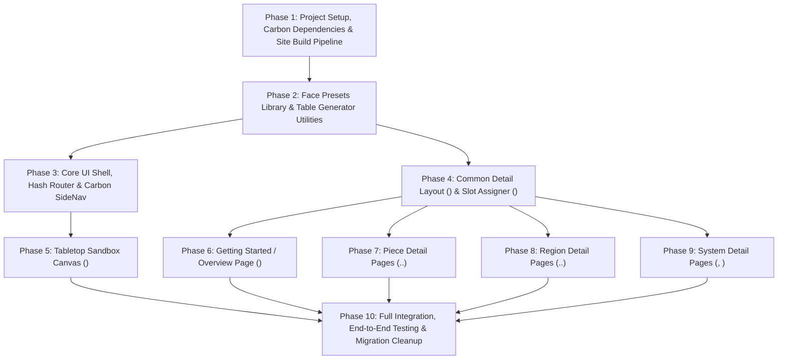

# Protoboard Example App Implementation Roadmap & Specifications (`bohnanza.impl.md`)

Based on the architectural specifications defined in [`docs/bohnanza.md`](./bohnanza.md), this document details the phased, component-by-component implementation roadmap for the **Protoboard Example App** (Bohnanza). Each phase is ordered strictly by its architectural and runtime dependencies, with all tasks numbered hierarchically for reference.

---

## 1. Dependency Graph

---

## 2. Phased Implementation Plan

### Phase 1: Project Setup, Carbon Dependencies & Site Build Pipeline

**Goal**: Install IBM Carbon dependencies, configure the Rollup build pipeline for `site/`, and establish the HTML/CSS entry point.
**Dependencies**: None.

- [ ] **1. Phase 1: Project Setup, Carbon Dependencies & Site Build Pipeline**
  - [ ] **1.1 Dependency Installation**
    - [ ] 1.1.1 Add `@carbon/web-components` and `@carbon/styles` to `package.json`.
    - [ ] 1.1.2 Verify dependency installation and module resolution.
  - [ ] **1.2 Build & Bundler Configuration**
    - [ ] 1.2.1 Configure `rollup.config.mjs` with a new build target compiling `site/src/main.ts` into `site/dist/site.min.js`.
    - [ ] 1.2.2 Add `build:site` script to `package.json` and update `build` script to build the Protoboard library followed by the site bundle.
  - [ ] **1.3 Site Entry Point & Styling**
    - [ ] 1.3.1 Create `site/index.html` loading Carbon Plex fonts, stylesheet, `dist/protoboard.min.js`, and `site/dist/site.min.js`.
    - [ ] 1.3.2 Create `site/styles.css` establishing 3-pane flex/grid layout variables, theme styling, and base container styles.

---

### Phase 2: Face Presets Library & Table Generator Utilities

**Goal**: Implement the 20 standardized 64×64 px SVG face preset generators and the reusable `<cds-table>` generation utilities.
**Dependencies**: Phase 1.

- [ ] **2. Phase 2: Face Presets Library & Table Generator Utilities**
  - [ ] **2.1 Standard 64×64 px Face Presets (`site/src/presets.ts`)**
    - [ ] 2.1.1 Implement 6 Dice pip SVG templates (`pip-1` through `pip-6`).
    - [ ] 2.1.2 Implement 5 Card suit symbol SVG templates (`card-spade`, `card-heart`, `card-diamond`, `card-club`, `card-joker`).
    - [ ] 2.1.3 Implement 5 Token & shape SVG templates (`meeple`, `circle-red`, `circle-yellow`, `circle-green`, `circle-blue`).
    - [ ] 2.1.4 Implement 4 Tabletop symbol SVG templates (`symbol-arrow`, `symbol-sword`, `symbol-shield`, `symbol-star`).
    - [ ] 2.1.5 Export preset metadata catalog mapping preset IDs, display names, categories, and render functions.
  - [ ] **2.2 Table Generator Utilities (`site/src/table-utils.ts`)**
    - [ ] 2.2.1 Implement `renderAttributesTable(attributes: readonly AttributeDescriptor[])` returning a structured `<cds-table>` Web Component with `Attribute`, `Type`, `Default`, and `Description` columns.
    - [ ] 2.2.2 Implement `renderActionsTable(actions: readonly ActionDescriptor[])` returning a structured `<cds-table>` Web Component with `Action`, `Default Key`, and `Description` columns.
  - [ ] **2.3 Unit Testing**
    - [ ] 2.3.1 Unit tests for `presets.ts` verifying all 20 presets generate valid, non-empty 64×64 px SVG markup.
    - [ ] 2.3.2 Unit tests for `table-utils.ts` verifying correct column headers and row cell contents.

---

### Phase 3: Core UI Shell, Hash Router & Carbon SideNav

**Goal**: Build the IBM Carbon UI shell, left-side navigation with clean component names, and client-side hash router with redirect fallback.
**Dependencies**: Phase 2.

- [ ] **3. Phase 3: Core UI Shell, Hash Router & Carbon SideNav**
  - [ ] **3.1 Carbon UI Shell (`site/src/main.ts`)**
    - [ ] 3.1.1 Mount `<cds-header>` with title `Protoboard Explorer`, menu button toggle, and GitHub repository action.
    - [ ] 3.1.2 Assemble 3-pane layout containers (`#nav-pane`, `#middle-pane`, `#sandbox-pane`).
  - [ ] **3.2 Carbon SideNav**
    - [ ] 3.2.1 Build `<cds-side-nav>` with `<cds-side-nav-items>` grouped into Overview (`#overview`), Pieces (`#d1` through `#dn`), Regions (`#slot`, `#deck`, `#bag`, `#chute`), and System (`#hand-overlay`, `#action-popup`).
    - [ ] 3.2.2 Wire menu toggle button to expand and collapse `<cds-side-nav>`.
  - [ ] **3.3 Client-Side Hash Router (`site/src/router.ts`)**
    - [ ] 3.3.1 Implement route map associating `#overview`, piece routes, region routes, and system routes with corresponding `<pbd-page-*>` custom element tags.
    - [ ] 3.3.2 Implement `hashchange` listener to dynamically mount active page elements into `#middle-pane`.
    - [ ] 3.3.3 Implement active state synchronization across `<cds-side-nav-link>` items and parent menus.
    - [ ] 3.3.4 Implement explicit redirect fallback setting `window.location.hash = '#overview'` on empty, missing, or unrecognized hashes.
  - [ ] **3.4 Unit & Navigation Testing**
    - [ ] 3.4.1 Test router hash resolution, element mounting, and redirect behavior.

---

### Phase 4: Common Detail Layout (`<pbd-detail-layout>`) & Slot Assigner (`<pbd-slot-assigner>`)

**Goal**: Implement the reusable detail page layout component and the face slot assigner widget for piece pages.
**Dependencies**: Phase 2.

- [ ] **4. Phase 4: Common Detail Layout & Slot Assigner**
  - [ ] **4.1 Reusable Slot Assigner (`<pbd-slot-assigner>`, `site/src/components/slot-assigner.ts`)**
    - [ ] 4.1.1 Render slot rows for `slot="face0"` through `slot="faceN-1"`.
    - [ ] 4.1.2 Provide visual preset picker dropdown/modal for selecting from the 20 built-in presets.
    - [ ] 4.1.3 Render 64×64 px thumbnail preview for each selected slot.
    - [ ] 4.1.4 Provide dynamic slot add/remove controls for `<pb-dn>`.
  - [ ] **4.2 Detail Layout Component (`<pbd-detail-layout>`, `site/src/components/detail-layout.ts`)**
    - [ ] 4.2.1 Accept `title` and `tag` attributes; provide slots for `description`, `attributes`, `actions`, `controls`, and `slot-assigner`.
    - [ ] 4.2.2 Implement preview section with `<cds-content-switcher>` toggling between Live Component View and HTML Code View.
    - [ ] 4.2.3 Integrate `<cds-code-snippet type="multi">` displaying reactive, token-highlighted HTML markup with one-click copy button.
    - [ ] 4.2.4 Implement `<cds-button kind="primary">Add to Sandbox</cds-button>` dispatching component creation event to sandbox.
  - [ ] **4.3 Unit Testing**
    - [ ] 4.3.1 Test `<pbd-slot-assigner>` preset mapping and dynamic face count changes.
    - [ ] 4.3.2 Test `<pbd-detail-layout>` slot projections and preview switcher toggling.

---

### Phase 5: Tabletop Sandbox Canvas (`<pbd-sandbox-pane>`)

**Goal**: Implement the live right-pane sandbox equipped with `<pb-hand-overlay>`, `<pb-action-popup>`, default `#sandbox-main-slot`, and dynamic sibling region container.
**Dependencies**: Phase 3.

- [ ] **5. Phase 5: Tabletop Sandbox Canvas (`<pbd-sandbox-pane>`)**
  - [ ] **5.1 Sandbox Component (`site/src/components/sandbox-pane.ts`)**
    - [ ] 5.1.1 Mount root `<pb-hand-overlay>` and `<pb-action-popup>`.
    - [ ] 5.1.2 Render empty default `<pb-slot id="sandbox-main-slot">` taking up primary canvas area.
    - [ ] 5.1.3 Render flex container for dynamic sibling regions alongside `#sandbox-main-slot`.
  - [ ] **5.2 Dynamic Component Insertion API**
    - [ ] 5.2.1 Implement piece insertion appending newly created piece DOM elements into `#sandbox-main-slot`.
    - [ ] 5.2.2 Implement region insertion appending newly created region DOM elements as siblings to `#sandbox-main-slot`.
  - [ ] **5.3 Unit & Interaction Testing**
    - [ ] 5.3.1 Test adding pieces to `#sandbox-main-slot` and regions to sibling container.

---

### Phase 6: Getting Started / Overview Page (`<pbd-page-overview>`)

**Goal**: Implement the documentation overview page providing the quick start guide, library initialization instructions, and keyboard shortcuts cheat-sheet.
**Dependencies**: Phase 4.

- [ ] **6. Phase 6: Getting Started / Overview Page (`<pbd-page-overview>`)**
  - [ ] **6.1 Overview Page Component (`site/src/pages/overview-page.ts`)**
    - [ ] 6.1.1 Document library purpose, declarative HTML philosophy, and installation/script inclusion.
    - [ ] 6.1.2 Document core concepts: hover/focus targeting, LIFO hand stack (`c`/`Space`), and action discovery (`?`).
    - [ ] 6.1.3 Render interactive keyboard shortcuts cheat-sheet `<cds-table>`.
    - [ ] 6.1.4 Provide quick links to Piece, Region, and System documentation pages.
  - [ ] **6.2 Unit Testing**
    - [ ] 6.2.1 Test `<pbd-page-overview>` rendering and shortcut table structure.

---

### Phase 7: Piece Detail Pages (`<pbd-page-d1>` through `<pbd-page-dn>`)

**Goal**: Implement dedicated documentation and interactive creator pages for all piece components.
**Dependencies**: Phase 4.

- [ ] **7. Phase 7: Piece Detail Pages (`<pbd-page-d1>` through `<pbd-page-dn>`)**
  - [ ] **7.1 Single-Faced Piece Page (`site/src/pages/piece-pages.ts`)**
    - [ ] 7.1.1 Implement `<pbd-page-d1>` (`D1`, `pb-d1`) with description, attributes table, actions table (`pick`, `rotate`), controls (`name`, `rotations`, action overrides), and `meeple` preset.
  - [ ] **7.2 Flippable & Polyhedral Piece Pages**
    - [ ] 7.2.1 Implement `<pbd-page-d2>` (`D2`, `pb-d2`, coin/token, `flip`).
    - [ ] 7.2.2 Implement `<pbd-page-d4>` (`D4`, `pb-d4`, 4 faces, `flip`).
    - [ ] 7.2.3 Implement `<pbd-page-d6>` (`D6`, `pb-d6`, 6 pip faces, `roll`, `flip`).
    - [ ] 7.2.4 Implement `<pbd-page-d8>` (`D8`, `pb-d8`, 8 faces, `roll`, `flip`).
    - [ ] 7.2.5 Implement `<pbd-page-d12>` (`D12`, `pb-d12`, 12 faces, `roll`, `flip`).
    - [ ] 7.2.6 Implement `<pbd-page-d20>` (`D20`, `pb-d20`, 20 faces, `roll`, `flip`).
  - [ ] **7.3 Custom N-Sided Piece Page**
    - [ ] 7.3.1 Implement `<pbd-page-dn>` (`DN`, `pb-dn`, dynamic face slots, `roll`, face cycling).
  - [ ] **7.4 Unit & Component Testing**
    - [ ] 7.4.1 Unit tests verifying attributes, actions, and preset assignment for all piece pages.

---

### Phase 8: Region Detail Pages (`<pbd-page-slot>` through `<pbd-page-chute>`)

**Goal**: Implement dedicated documentation and interactive creator pages for all region components.
**Dependencies**: Phase 4.

- [ ] **8. Phase 8: Region Detail Pages (`<pbd-page-slot>` through `<pbd-page-chute>`)**
  - [ ] **8.1 Slot Region Page (`site/src/pages/region-pages.ts`)**
    - [ ] 8.1.1 Implement `<pbd-page-slot>` (`Slot`, `pb-slot`, 2D drop zone, `drop`, `drop-all`).
  - [ ] **8.2 Deck Region Page**
    - [ ] 8.2.1 Implement `<pbd-page-deck>` (`Deck`, `pb-deck`, card stack, `shuffle`, `flip-all`, `pick-all`).
  - [ ] **8.3 Bag Region Page**
    - [ ] 8.3.1 Implement `<pbd-page-bag>` (`Bag`, `pb-bag`, blind draw container, `pick` random, `pick-all`).
  - [ ] **8.4 Chute Region Page**
    - [ ] 8.4.1 Implement `<pbd-page-chute>` (`Chute`, `pb-chute`, multi-layer filter, `flush`, layer configuration builder).
  - [ ] **8.5 Unit & Component Testing**
    - [ ] 8.5.1 Unit tests verifying attributes, actions, and configuration for all region pages.

---

### Phase 9: System Detail Pages (`<pbd-page-hand-overlay>`, `<pbd-page-action-popup>`)

**Goal**: Implement dedicated documentation pages for global singleton systems.
**Dependencies**: Phase 4.

- [ ] **9. Phase 9: System Detail Pages (`<pbd-page-hand-overlay>`, `<pbd-page-action-popup>`)**
  - [ ] **9.1 Hand Overlay Page (`site/src/pages/system-pages.ts`)**
    - [ ] 9.1.1 Implement `<pbd-page-hand-overlay>` (`Hand Overlay`, `pb-hand-overlay`, LIFO floating cursor stack, setup code snippet).
  - [ ] **9.2 Action Popup Page**
    - [ ] 9.2.1 Implement `<pbd-page-action-popup>` (`Action Popup`, `pb-action-popup`, action discovery `?`, setup code snippet).
  - [ ] **9.3 Unit & Component Testing**
    - [ ] 9.3.1 Unit tests verifying system page rendering and documentation tables.

---

### Phase 10: Full Integration, End-to-End Testing & Migration Cleanup

**Goal**: Integrate all application components, execute end-to-end browser test suites across all target browsers, clean up legacy prototype files, and update documentation.
**Dependencies**: Phases 5, 6, 7, 8, 9.

- [ ] **10. Phase 10: Full Integration, End-to-End Testing & Migration Cleanup**
  - [ ] **10.1 Legacy Cleanup & Migration**
    - [ ] 10.1.1 Delete legacy `examples/index.html`.
    - [ ] 10.1.2 Update `examples/README.md` and root `README.md` links pointing to `site/index.html`.
  - [ ] **10.2 End-to-End Playwright Test Suite (`e2e/site.test.ts`)**
    - [ ] 10.2.1 Test 3-pane layout, collapsible SideNav, and initial hash redirect to `#overview`.
    - [ ] 10.2.2 Test piece creator: configuring a D6 die, toggling live preview, rolling with `r`, toggling HTML view, copying markup, and clicking "Add to Sandbox" to insert into `#sandbox-main-slot`.
    - [ ] 10.2.3 Test region creator: creating a `Deck` region, verifying it appears as a sibling in the sandbox, dropping cards, and shuffling with `s`.
    - [ ] 10.2.4 Execute tests across Chromium, Firefox, and WebKit.
  - [ ] **10.3 Directory Documentation**
    - [ ] 10.3.1 Update `site/README.md` and `site/src/README.md` inventories.
    - [ ] 10.3.2 Update `docs/README.md` inventory with `bohnanza.impl.md`.
